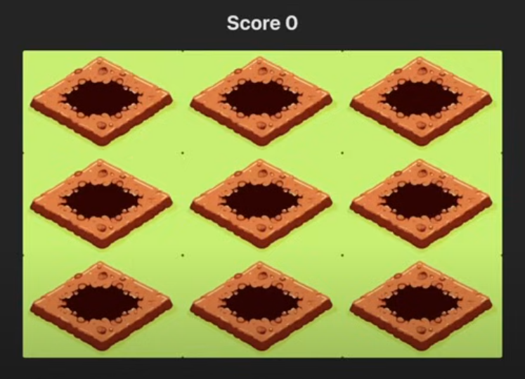

# React Whack-a-Mole Game Challenge

## Overview

Create a beginner-level React application that implements a Whack-a-Mole game. This challenge is designed to test your React skills, including state management, effects, timeouts, and intervals.

## Requirements

1. Game Board:

   - Implement a 3x3 grid to represent the game board.
   - Each cell in the grid should represent a mole hole.

2. Mole Behavior:

   - Moles should randomly appear in the holes for a short duration.
   - After the duration expires, the mole should disappear (hide).

3. User Interaction:

   - Allow the user to click on the moles.
   - Clicking a visible mole should be registered as a hit.

4. Scoring:

   - Implement a scoring system.
   - Increment the score each time the user successfully clicks a mole.

5. Visual Elements:

   - Display an empty hole image when no mole is present.
   - Show a mole image when a mole appears.

6. Game Logic:

   - Use React hooks to manage game state and effects.
   - Implement timeouts or intervals to control mole appearances.

7. UI/UX:
   - Display the current score prominently.
   - Ensure the game is visually appealing and intuitive to play.

## Bonus Features (Optional)

- Add difficulty levels that adjust mole appearance frequency and duration.
- Implement a game timer and create a "game over" state.
- Add sound effects for successful hits and misses.

##

